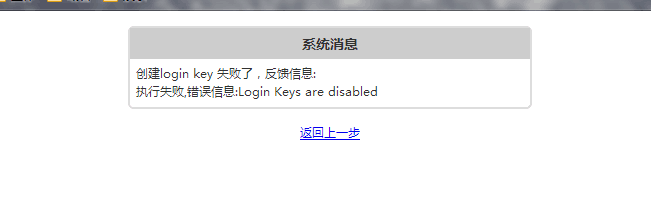

解决办法：

	cd /usr/local/directadmin/data/users
	grep login_keys */user.conf
	grep 'login_keys=OFF' -nR */user.conf | awk -F: '{print $1}' | xargs -I {} sed -i 's/login_keys=OFF/login_keys=ON/g' {}
	/etc/init.d/directadmin restart

### [Connecting to DA with an API script, or giving out your DA password?](http://forum.directadmin.com/showthread.php?t=47667&p=249737#post249737)